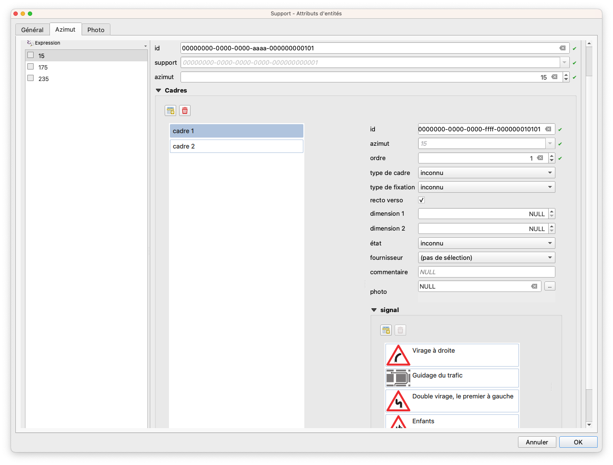
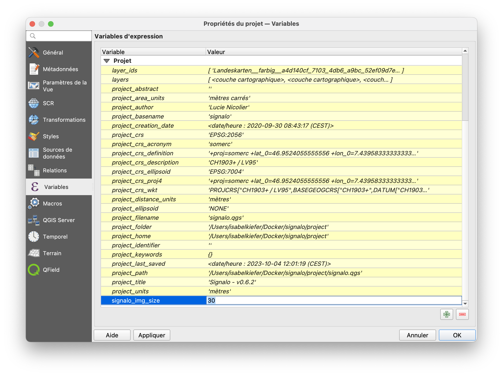

##Edition

### Ajout de signaux

* Mettre la couche "Support" en édition et digitaliser un point pour ouvrir le formulaire.
* Le formulaire et composé de trois onglets "Général", "Azimut" et "Photo"

<figure markdown>
  { width="500"  }
  <figcaption>Onglet général</figcaption>
</figure>
<figure markdown>
  { width="500"  }
  <figcaption>Onglet azimut</figcaption>
</figure>
<figure markdown>
  { width="500"  }
  <figcaption>Onglet photo</figcaption>
</figure>

Dans l’onglet “Azimut”, les cadres et signaux peuvent y être saisis. 

<figure markdown>
  { width="500"  }
  <figcaption>Exemple d'un azimut avec plusieurs cadres et signaux</figcaption>
</figure>

## Taille des panneaux

La taille des panneaux peut être ajustée dans les propriétés du projet, dans l'onglet `Variables`, en modifiant la variable `signalo_img_size`.

<figure markdown>
  { width="500"  }
  <figcaption>Réglage de la taille de l'image</figcaption>
</figure>

## Environnements de travail 

Vous avez la possibilité d'avoir plusieurs environnements de travail: test, production, …
Plusieurs fichiers projets sont disponibles avec chaque version:

| Fichier projet | nom du service PG     | exemple d'utilisation | 
| ------------- | ---------------------- | --------------------- |
| `signalo.qgs` | `pg_signalo`           | demo                  |
| `signalo_prod.qgs` | `pg_signalo_prod` | production            |
| `signalo_dev.qgs` | `pg_signalo_dev`   | test et développement |

## Filtrage et analyse de la cohérence globale

Cette fonctionnalité devrait être [améliorée](roadmap.md) dans les versions suivantes.

Il est possible de filtrer l'affichage des panneaux au moyen de la couche "Vue filtrage".
Avec un clic-droit sur la couche, sélectionner "Filtrer…" dans le menu.
Il faut alors construire une requête pour filtrer les éléments.

<figure markdown>
  { width="500"  }
  <figcaption>Filtrage des signaux</figcaption>
</figure>

