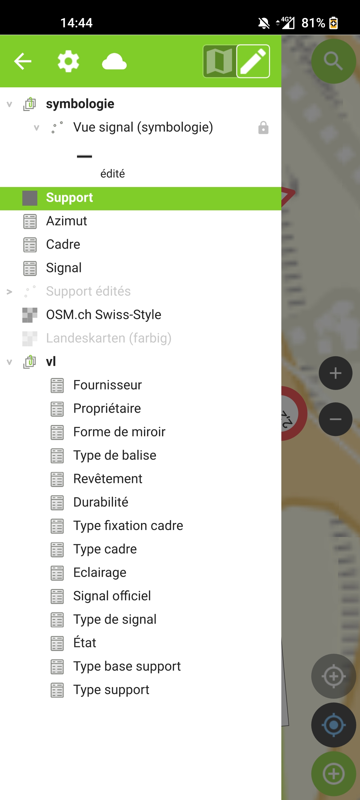

Pour le travail de terrain, l'application mobile [**QField**](https://qfield.org/) et l'extension pour QGIS [**QFieldSync**](https://plugins.qgis.org/plugins/qfieldsync/) sont utilisées.

Nous renvoyons ici vers la [documentation de QField](https://docs.qfield.org/get-started/) pour les étapes de préparation du projet de terrain.

!!! info "Édition sous QField"

    === "Carte"
          { width="300" align="left"; loading=lazy }

    === "Légende"
          { width="300" align="left"; loading=lazy }

    === "Formulaire d'attribut"
          { width="300" align="left"; loading=lazy }

> A noter : L'affichage des signaux sur la carte dépend d'une vue dans la base de données. Comme le travail de terrain est effectué hors ligne avec une copie locale des données, la couche dont dépend la symbologie n'est pas mise à jour sur le terrain. L'affichage des signaux nouveaux ou édités sur la carte ne fonctionne donc pas dans QField.
